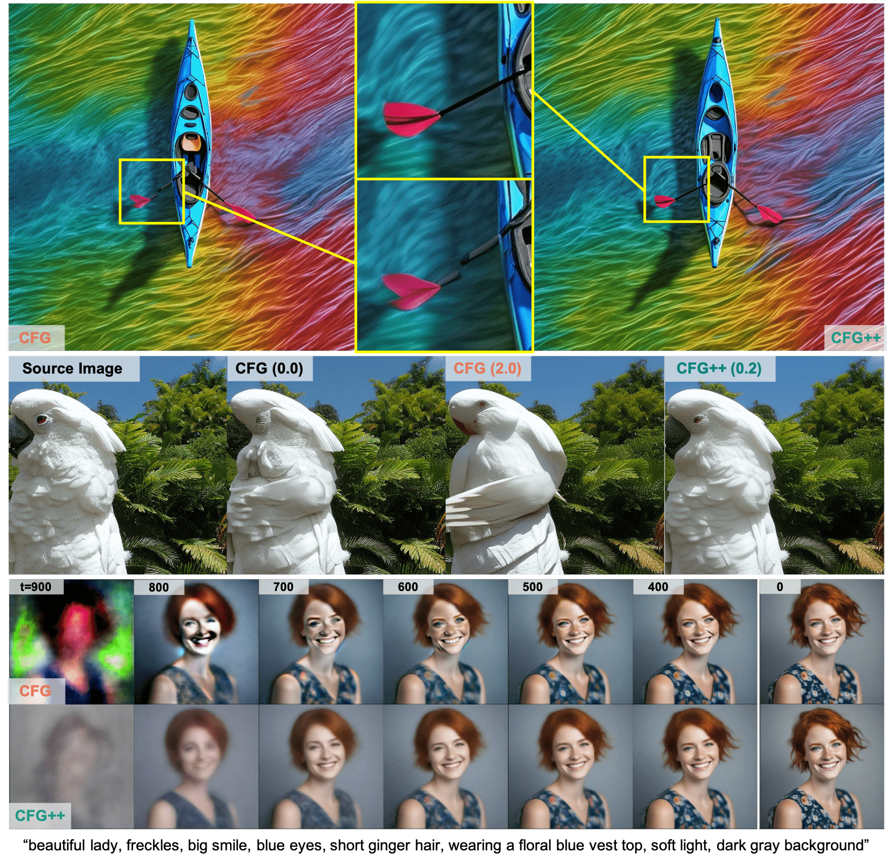

# CFG++ : MANIFOLD-CONSTRAINED CLASSIFIER FREE GUIDANCE FOR DIFFUSION MODELS



---
## Summary

*Classifier-free guidance (CFG)* is a fundamental tool in modern diffusion models for text-guided generation. Although effective, CFG requires high guidance scales, which has notable drawbacks:

1. Mode collapse and saturation
2. Poor invertibility
3. Unnatural, curved PF-ODE trajectory

We propose a simple fix to this seemingly inherent limitation and propose CFG++, which corrects the off-manifold problem of CFG. The following advantages are observed

1. Small guidance scale $\lambda \in$ [0, 1] can be used with a similar effect as $\omega \in$ [1.0, 12.5] in CFG
2. Better sample quality and better adherence to text
3. Smooth, straighter PF-ODE trajectory
4. Enhanced invertibility

Experimental results confirm that our method significantly enhances performance in text-to-image generation, DDIM inversion, editing, and solving inverse problems, suggesting a wide-ranging impact and potential applications in various fields that utilize text guidance.

## Setup

First, create your environment. We recommand to use the following comments. 

```
git clone https://github.com/CFGpp-diffusion/CFGpp.git
cd CFGpp
conda env create -f environment.yaml
```

For reproducability, using the same package version is neccessary since some dependencies lead to significant differences (for instance, diffusers). Nonetheless, improvement induced by CFG++ will be observed regardless the dependency.

If you run one of below examples, diffusers will automatically download checkpoints for SDv1.5 or SDXL.


## Examples

### Text-to-Image generation

- CFG
```
python -m examples.text_to_img --prompt "a portrait of a dog" --method "ddim" --cfg_guidance 7.5
```

- CFG ++
```
python -m examples.text_to_img --prompt "a portrait of a dog" --method "ddim_cfg++" --cfg_guidance 0.6
```


### Image Inversion

- CFG
```
python -m examples.inversion --prompt "a photography of baby fox" --method "ddim_inversion" --cfg_guidance 7.5
```

- CFG ++
```
python -m examples.inversion --prompt "a photography of baby fox" --method "ddim_inverion_cfg++" --cfg_guidance 0.6
```

### Image Editing

- CFG
```
python -m examples.image_edit --src_prompt "a photography of baby fox" --tgt_prompt "a photography of a goat" --method "ddim_edit" --model "sdxl" --cfg_guidance 7.5
```

- CFG ++
```
python -m examples.image_edit --src_prompt "a photography of baby fox" --tgt_prompt "a photography of a goat" --method "ddim_edit_cfg++" --model "sdxl" --cfg_guidance 0.6
```

## Callback

We provide callback functionality to monitor intermediate samples during diffusion reverse process. For now, the function could be called only at the end of each timestep, for the readability of scripts.

Currently, we provide two options (default: None).
- draw_tweedie : save $\hat x_{0|t}$ to workdir
- draw_noisy : save $x_t$ to workdir

Note that using callback may take more time due to file save. You can refer utils/callback_util.py for details.

## Reference
If you find our method is useful, please cite below or leave a star to this repository.

```
coming soon
```
